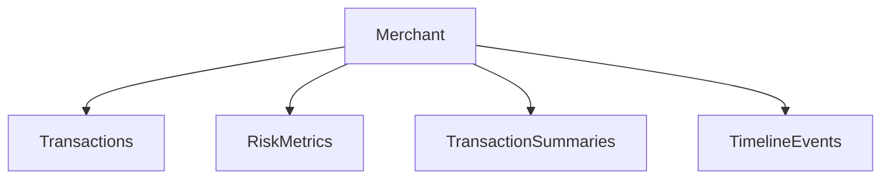

# Database Schema and Models Documentation

## Overview
This documentation covers the core database models, schemas, and data structures used in the Merchant Risk Analysis System. The system uses SQLAlchemy for ORM and Pydantic for data validation.

## Database Configuration
The database connection is managed through environment variables and SQLAlchemy:

```python
DATABASE_URL = os.getenv("DATABASE_URL")
engine = create_engine(
    DATABASE_URL,
    pool_size=5,
    max_overflow=10,
    pool_timeout=30,
    pool_pre_ping=True
)
```

Key features:
- Connection pooling with size of 5 and max overflow of 10
- Connection timeout of 30 seconds
- Pool pre-ping enabled for connection health checks
- Automatic postgres:// to postgresql:// URL conversion for Render compatibility

## Core Models

### Merchant
Represents a business entity in the system.

#### Fields:
- `merchant_id`: Unique identifier (format: M[0-9]{7})
- `business_name`: Company name
- `business_type`: Type of business
- `registration_date`: Date of registration
- `business_model`: Online/Offline/Hybrid
- `product_category`: Main product category
- `average_ticket_size`: Average transaction amount
- `gst_status`: GST registration status
- `epfo_registered`: EPFO registration status
- `registered_address`: Business address
- `city`: Business city
- `state`: Business state
- `reported_revenue`: Annual revenue
- `employee_count`: Number of employees
- `bank_account`: Bank account number

### Transaction
Records individual transactions processed by merchants.

#### Fields:
- `transaction_id`: Unique transaction identifier
- `merchant_id`: Associated merchant ID
- `receiver_merchant_id`: Recipient merchant ID
- `timestamp`: Transaction timestamp
- `amount`: Transaction amount
- `payment_method`: Method of payment
- `status`: Transaction status (success/failed/pending)
- `product_category`: Product category
- `platform`: Transaction platform
- `customer_location`: Customer's location
- `customer_id`: Unique customer identifier
- `device_id`: Device identifier

#### Risk Flags:
- `velocity_flag`: High transaction velocity
- `amount_flag`: Unusual amount
- `time_flag`: Suspicious timing
- `device_flag`: Device-related risks

### RiskMetrics
Stores calculated risk scores for merchants.

#### Risk Scores (0-1 scale):
- `late_night_score`: Unusual hour transactions
- `sudden_spike_score`: Abnormal volume spikes
- `velocity_abuse_score`: Transaction velocity
- `device_switching_score`: Multiple device usage
- `location_hopping_score`: Location changes
- `payment_cycling_score`: Payment method cycling
- `round_amount_score`: Round amount transactions
- `customer_concentration_score`: Customer diversity
- `composite_risk_score`: Overall risk score

### TransactionSummary
Daily aggregated transaction metrics.

#### Summary Metrics:
- `txn_count`: Total transactions
- `total_volume`: Total amount
- `avg_amount`: Average transaction size
- `max_amount`: Largest transaction
- `min_amount`: Smallest transaction
- `unique_customers`: Customer count
- `unique_payment_methods`: Payment method count

### TimelineEvent
Records significant events and anomalies.

#### Event Details:
- `event_type`: Type of event
- `timestamp`: Event occurrence time
- `details`: JSON event details
- `severity`: Event severity level
- `processed`: Processing status
- `created_at`: Record creation time

## Database Relationships

### Merchant Relationships:


## Database Utilities

### Session Management
```python
def get_db():
    db = SessionLocal()
    try:
        yield db
    finally:
        db.close()
```

### Data Migration
```python
def migrate_transaction_statuses(db: Session):
    """Updates legacy 'completed' status to 'success'"""
```

## Indexes and Performance
- Primary key indexes on all ID fields
- Composite index on merchant_id and timestamp for timeline events
- Unique constraints on merchant_id and transaction_id
- Foreign key relationships for referential integrity

## Best Practices
1. Always use the `get_db()` context manager for database operations
2. Implement proper error handling for database operations
3. Use transactions for multi-step operations
4. Monitor connection pool usage
5. Regular index maintenance for optimal performance

## Error Handling
The system implements comprehensive error handling:
- Connection errors
- Pool timeout errors
- Migration errors
- Transaction rollbacks
- Validation errors

