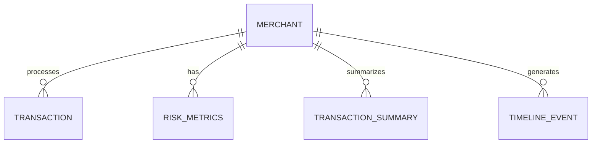

# Merchant Risk Analysis System - Database Documentation

## Table of Contents
1. [Overview](#overview)
2. [Database Architecture](#database-architecture)
3. [Core Models](#core-models)
4. [Database Configuration](#database-configuration)
5. [Data Relationships](#data-relationships)
6. [Performance Optimizations](#performance-optimizations)
7. [Security Considerations](#security-considerations)
8. [Best Practices](#best-practices)
9. [Troubleshooting](#troubleshooting)

## Overview

The Merchant Risk Analysis System uses a relational database architecture to track and analyze merchant transactions, risk metrics, and behavioral patterns. The system is built using SQLAlchemy ORM with PostgreSQL as the primary database.

### Key Features
- Real-time transaction monitoring
- Risk score calculation and tracking
- Historical data analysis
- Event timeline tracking
- Transaction aggregation and summarization

## Database Architecture

### Schema Design Philosophy
The database follows these core principles:
- Normalization to 3NF for data integrity
- Strategic denormalization for performance
- Comprehensive indexing strategy
- Audit trail capabilities
- Scalable relationship design

### Entity Relationship Diagram


## Core Models

### Merchant Model
```python
class Merchant(Base):
    __tablename__ = "merchants"
```

#### Purpose
Central entity representing business clients in the system.

#### Key Fields
| Field | Type | Description | Constraints |
|-------|------|-------------|-------------|
| merchant_id | String | Unique identifier | Format: M[0-9]{7} |
| business_name | String | Company name | Required |
| business_model | String | Operating model | Enum: Online/Offline/Hybrid |
| registration_date | DateTime | Registration date | Required |

#### Business Rules
- Each merchant must have a unique merchant_id
- Business model must be one of predefined types
- Registration date cannot be in the future

### Transaction Model
```python
class Transaction(Base):
    __tablename__ = "transactions"
```

#### Purpose
Records all financial transactions processed through the system.

#### Key Fields
| Field | Type | Description | Validation |
|-------|------|-------------|------------|
| transaction_id | String | Unique identifier | Required, Unique |
| amount | Float | Transaction amount | > 0 |
| status | String | Transaction status | Enum values |
| timestamp | DateTime | Processing time | Required |

#### Risk Flags
- velocity_flag: Unusual transaction frequency
- amount_flag: Suspicious transaction amount
- time_flag: Unusual timing patterns
- device_flag: Device-related risks

### RiskMetrics Model
```python
class RiskMetrics(Base):
    __tablename__ = "risk_metrics"
```

#### Purpose
Stores calculated risk scores and metrics for merchant analysis.

#### Risk Components
| Metric | Weight | Description | Calculation Basis |
|--------|---------|-------------|------------------|
| late_night_score | 0.15 | After-hours activity | Time distribution |
| sudden_spike_score | 0.15 | Volume anomalies | Statistical deviation |
| velocity_abuse_score | 0.15 | Transaction frequency | Time-based analysis |
| device_switching_score | 0.10 | Device patterns | Device diversity |

### TransactionSummary Model
```python
class TransactionSummary(Base):
    __tablename__ = "transaction_summaries"
```

#### Purpose
Provides aggregated daily transaction metrics for analysis.

#### Aggregation Metrics
- Transaction count
- Volume statistics
- Customer diversity
- Payment method variety

### TimelineEvent Model
```python
class TimelineEvent(Base):
    __tablename__ = "timeline_events"
```

#### Purpose
Tracks significant events and anomalies in merchant behavior.

#### Event Categories
- Risk threshold breaches
- Pattern changes
- Compliance events
- System alerts

## Database Configuration

### Connection Management
```python
engine = create_engine(
    DATABASE_URL,
    pool_size=5,
    max_overflow=10,
    pool_timeout=30,
    pool_pre_ping=True
)
```

### Configuration Parameters
| Parameter | Value | Purpose |
|-----------|-------|---------|
| pool_size | 5 | Base connection pool |
| max_overflow | 10 | Maximum extra connections |
| pool_timeout | 30 | Connection timeout (seconds) |
| pool_pre_ping | True | Connection health check |

## Performance Optimizations

### Indexing Strategy
1. Primary Keys
   - Automatically indexed
   - Used for relationship joins
   
2. Foreign Keys
   - merchant_id across all tables
   - Optimized for relationship queries

3. Composite Indexes
   ```sql
   CREATE INDEX idx_merchant_timestamp 
   ON timeline_events (merchant_id, timestamp);
   ```

### Query Optimization
- Efficient relationship loading
- Strategic use of lazy loading
- Batch processing capabilities

## Security Considerations

### Data Protection
1. Sensitive Fields
   - bank_account
   - customer_id
   - device_id

2. Access Control
   - Row-level security
   - Role-based access

### Audit Trail
- Timeline events track changes
- System maintains modification history

## Best Practices

### Database Operations
1. Connection Management
   ```python
   def get_db():
       db = SessionLocal()
       try:
           yield db
       finally:
           db.close()
   ```

2. Transaction Handling
   ```python
   try:
       db.execute(query)
       db.commit()
   except Exception:
       db.rollback()
       raise
   ```

### Data Integrity
1. Validation Rules
   - Amount must be positive
   - Timestamps must be valid
   - Status must be from enum

2. Relationship Constraints
   - Cascading deletes where appropriate
   - Referential integrity enforcement

## Troubleshooting

### Common Issues
1. Connection Pool Exhaustion
   - Symptoms: Timeout errors
   - Solution: Monitor pool usage

2. Performance Degradation
   - Symptoms: Slow queries
   - Solution: Index analysis, query optimization

### Monitoring
1. Key Metrics
   - Connection pool usage
   - Query performance
   - Error rates

2. Logging
   ```python
   logger = logging.getLogger(__name__)
   logger.debug("Database connection established")
   ```

## Migration Utilities

### Status Migration
```python
def migrate_transaction_statuses(db: Session):
    """Updates transaction status from 'completed' to 'success'"""
```

### Version Control
- Alembic migrations
- Schema version tracking
- Rollback capabilities

## Contributing Guidelines

### Code Style
- Follow SQLAlchemy conventions
- Document model changes
- Update migration scripts

### Testing Requirements
- Unit tests for models
- Integration tests for relationships
- Performance benchmarks

## Additional Resources

### Related Documentation
- [SQLAlchemy Documentation](https://docs.sqlalchemy.org/)
- [PostgreSQL Best Practices](https://www.postgresql.org/docs/current/performance-tips.html)
- [Database Design Patterns](https://docs.sqlalchemy.org/en/14/orm/patterns.html)

